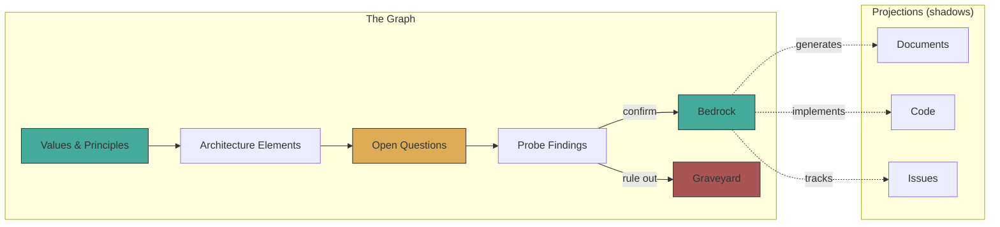
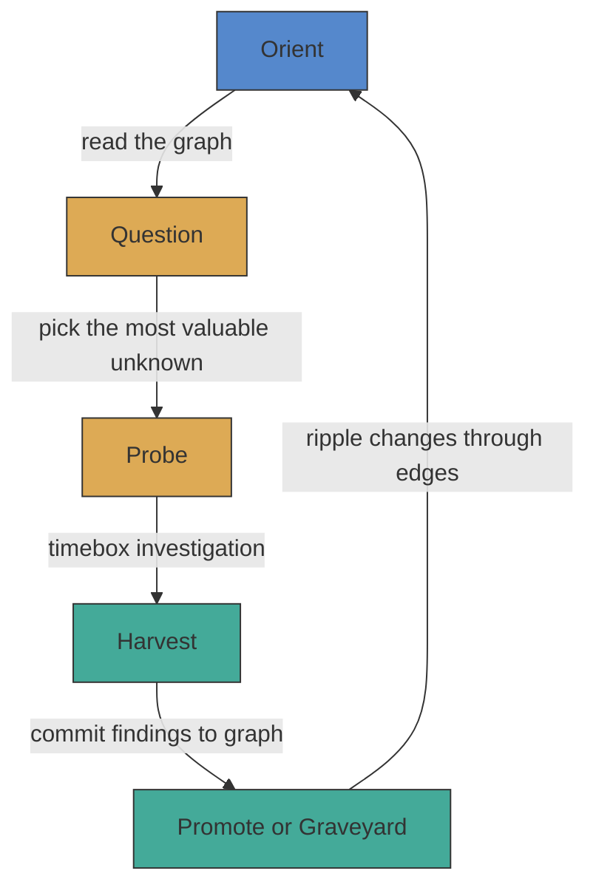
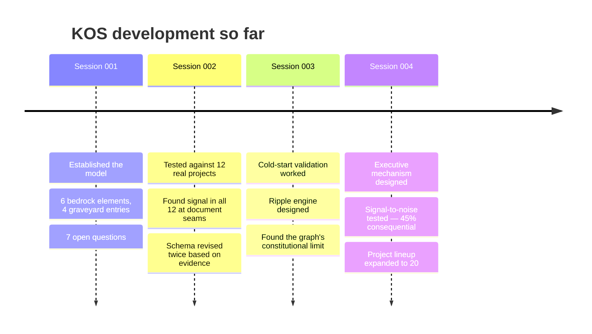

# KOS — Knowledge Operating System

Every project loses the understanding that built it. The code ships, but the
reasoning — failed approaches, load-bearing assumptions, why *this* design and
not *that* one — evaporates. It lives in a few heads and decays. Documents
written before building capture intent, not discovery. Documents written after
are archaeology.

KOS is an attempt to fix this. It treats **accumulated understanding as the
primary product**, not code, not documents — the knowledge graph underneath
both.

## What it does

KOS represents everything a project knows as a graph of typed nodes with
declared confidence and tracked dependencies. Documents and code are both
treated as *lossy projections* of this graph — like 2D shadows of an
N-dimensional object.



The graph can always generate the documents. The documents cannot recover the
graph. Signal — contradictions, gaps, drift — appears at the seams between
projections, where documents disagree with each other or with code.

## The process cycle

KOS uses a single cycle that scales from one person to many teams:



- **Orient**: Read the graph. What do we know? What's changed?
- **Question**: What's the most valuable thing we don't know?
- **Probe**: Investigate, timeboxed. Dead ends are findings too.
- **Harvest**: Commit results. Update nodes. Move confidence.
- **Promote or Graveyard**: What's now bedrock? What's been ruled out?

Nothing is deleted. The graveyard is append-only — what was tried and what was
learned is permanent. Confidence has three states:

| State | Meaning |
|-------|---------|
| **Bedrock** | Established. Evidence-based. Changing this breaks dependents. |
| **Frontier** | Active hypothesis. Expected to hold but may change. |
| **Graveyard** | Tried, ruled out, permanently recorded with rationale. |

## How this project is bootstrapping itself

KOS is being built using its own process. There is no implementation yet —
the project is establishing what the system *should be* by running the cycle
on itself. A human provides continuity and pattern recognition across
sessions. An AI collaborator provides inference and synthesis within sessions.



### What we've found so far

**Tested against 16 real projects** (ThreeDoors, project-alpha, penny-orc,
Backstage, Crossplane, Kubernetes KEPs, Rust RFCs, Go Proposals, Python PEPs,
BMAD enterprise, OpenHands, AutoGen, OpenClaw, Atmos, GitLab, Claude Code) —
the graph found signal at document seams in every one.

The signal breaks into categories that stabilized across the sample:

| Signal type | What it means | Example |
|-------------|--------------|---------|
| **Contradiction** | Two documents claim different things | PRD says `tasks.txt`, architecture says `tasks.yaml` |
| **Gap** | Something exists in one doc but is missing where it should appear | Success criterion depends on a feature missing from architecture |
| **Silent abandonment** | A decision was dropped with no record | Crossplane's immutability requirement disappeared between design docs |
| **Drift** | A reference went stale when something else changed | README says 35 knowledge fragments, actual count is 42 |
| **AI configuration seam** | Multiple AI tool configs contradict each other | `.cursor/rules` says write integration tests, `CLAUDE.md` says avoid them |
| **Enforcement gap** | Spec says a requirement exists, nothing checks for it | GitLab DoD lists 25 items, MR template checks 8 |

**Does the signal matter?** About 45% of issues found are consequential —
they caused bugs, confused users, or led to wasted effort. The other 55%
splits between "real but low impact" (32%) and "noise" (23%). The graph
doesn't find *more* problems than humans eventually find — it finds them
*faster*, before users hit them in production.

### What we've learned about the process

The most important findings are not about any specific project but about
how knowledge works:

1. **Documents, code, and repos are all lossy projections** of richer
   understanding. The same pattern recurs at every layer — documents flatten
   the spec graph, repos flatten the knowledge topology, files flatten the
   content-addressed DAG. Each is a human interface that loses structure.

2. **The graph can only hold what's been declared.** Undeclared structure —
   unconsidered alternatives, unconscious assumptions, unknown unknowns — is
   outside the graph by definition. The graph makes the *boundary* between
   known and unknown visible. It doesn't eliminate the unknown.

3. **The human's role is not a bottleneck.** The human sees patterns across
   undeclared conceptual relationships that the graph can't represent yet.
   Every time the human sees one, it gets promoted from tacit to explicit.
   Agents execute within declared structure. Humans expand it.

4. **The strongest predictor of signal yield is the review gap** — whether
   anyone checks if the documents agree with *each other*. Not governance
   quality, not visibility. Cross-document consistency review.

## Project structure

```
kos/
├── KOS-charter.md          # Re-introduction document (start here)
├── schema/
│   └── node.schema.yaml    # The node schema (v0.3, frontier)
├── nodes/                   # Graph nodes by confidence
│   ├── bedrock/
│   ├── frontier/
│   ├── graveyard/
│   └── placeholder/
├── probes/                  # Exploration briefs and work products
│   ├── brief-*.yaml
│   └── brief-*-nodes/
└── findings/                # Probe results (finding-001 through 026)
    └── finding-NNN-*.yaml
```

Start with [KOS-charter.md](KOS-charter.md) — it contains the full state of
the project, what's established, what's open, and what's been ruled out.

## Status

This is a research project in early stages. There is no software to run. The
artifacts in this repo *are* the product — a growing graph of understanding
about how knowledge accumulation systems should work, built by running the
process the system describes.

The findings are real. The model is under active validation. The
implementation is future work.
