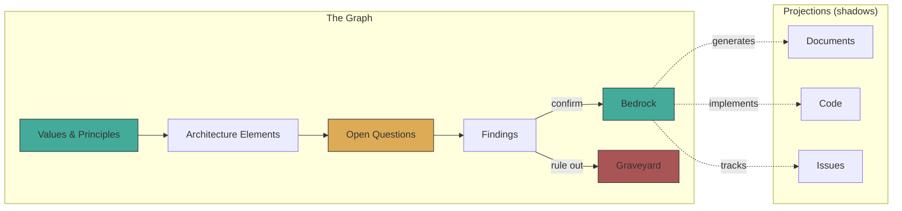
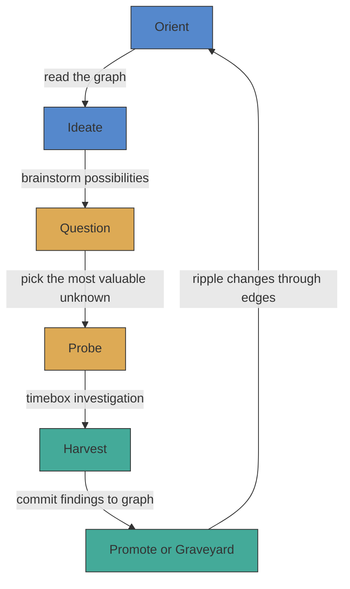
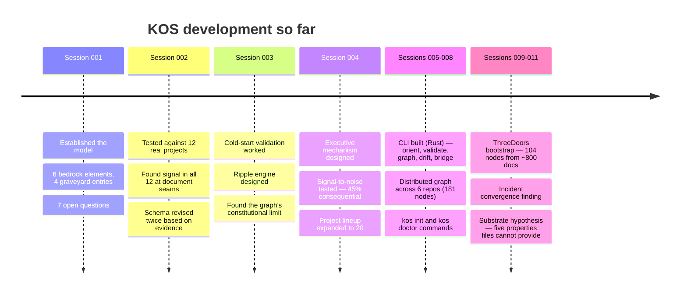

# KOS — Knowledge Operating System

Every project loses the understanding that built it. The code ships, but the
reasoning — failed approaches, load-bearing assumptions, why *this* design and
not *that* one — evaporates. It lives in a few heads and decays. Documents
written before building capture intent, not discovery. Documents written after
are archaeology.

KOS is an attempt to fix this. It treats **accumulated understanding as the
primary product** — not code, not documents — the knowledge graph underneath
both.

## What it does

KOS represents everything a project knows as a graph of typed nodes with
declared confidence and tracked dependencies. Documents and code are both
treated as *lossy projections* of this graph — like 2D shadows of an
N-dimensional object.



The graph can always generate the documents. The documents cannot recover the
graph. Signal — contradictions, gaps, drift — appears at the seams between
projections, where documents disagree with each other or with code.

## The process cycle

KOS uses a single cycle that scales from one person to many teams:



- **Orient**: Read the graph. What do we know? What's changed?
- **Ideate**: Brainstorm possibilities. Ideas are generative, possibly contradictory, and carry no commitment.
- **Question**: What's the most valuable thing we don't know?
- **Probe**: Investigate, timeboxed. Dead ends are findings too.
- **Harvest**: Commit results. Update nodes. Move confidence.
- **Promote or Graveyard**: What's now bedrock? What's been ruled out?

Nothing is deleted. The graveyard is append-only — what was tried and what was
learned is permanent. Confidence has three states:

| State | Meaning |
|-------|---------|
| **Bedrock** | Established. Evidence-based. Changing this breaks dependents. |
| **Frontier** | Active hypothesis. Expected to hold but may change. |
| **Graveyard** | Tried, ruled out, permanently recorded with rationale. |

## The CLI

A Rust CLI reads typed YAML nodes from git, validates them, renders
graphs, detects drift, and surfaces relevant knowledge per-repo:

```
kos orient <repo>     # what does the graph know about this repo?
kos validate          # schema check all nodes
kos graph             # render node graph (mermaid or dot)
kos drift             # content hash + edge walk → flag stale dependents
kos bridge            # extract findings from prose briefs
kos init              # onboard a new repo into the graph
kos doctor            # health check structure, content, process
```

## What we've found

**Tested against 16 real projects** (ThreeDoors, project-alpha, penny-orc,
Backstage, Crossplane, Kubernetes KEPs, Rust RFCs, Go Proposals, Python PEPs,
BMAD enterprise, OpenHands, AutoGen, OpenClaw, Atmos, GitLab, Claude Code) —
the graph found signal at document seams in every one.

About 45% of issues found are consequential — bugs, confusion, wasted effort.
The other 55% splits between "real but low impact" (32%) and "noise" (23%).
The graph doesn't find *more* problems than humans eventually find — it finds
them *faster*, before users hit them in production.

The signal breaks into categories that stabilized across the sample:

| Signal type | What it means | Example |
|-------------|--------------|---------|
| **Contradiction** | Two documents claim different things | PRD says `tasks.txt`, architecture says `tasks.yaml` |
| **Gap** | Something exists in one doc but is missing where it should appear | Success criterion depends on a feature missing from architecture |
| **Silent abandonment** | A decision was dropped with no record | Crossplane's immutability requirement disappeared between design docs |
| **Drift** | A reference went stale when something else changed | README says 35 knowledge fragments, actual count is 42 |
| **AI configuration seam** | Multiple AI tool configs contradict each other | `.cursor/rules` says write integration tests, `CLAUDE.md` says avoid them |
| **Enforcement gap** | Spec says a requirement exists, nothing checks for it | GitLab DoD lists 25 items, MR template checks 8 |

The strongest predictor of signal yield is the **review gap**: whether anyone
checks if documents agree with *each other*. Not governance quality, not
visibility. Cross-document consistency review.

## What we've learned about knowledge

The most important findings are not about any specific project but about
how knowledge works:

1. **Documents, code, and repos are all lossy projections** of richer
   understanding. The same pattern recurs at every layer — documents flatten
   the spec graph, repos flatten the knowledge topology, files flatten the
   content-addressed DAG. Each is a human interface that loses structure.

2. **The graph can only hold what's been declared.** Undeclared structure —
   unconsidered alternatives, unconscious assumptions, unknown unknowns — is
   outside the graph by definition. The graph makes the *boundary* between
   known and unknown visible. It doesn't eliminate the unknown.

3. **The human's role is not a bottleneck.** The human sees patterns across
   undeclared conceptual relationships that the graph can't represent yet.
   Every time the human sees one, it gets promoted from tacit to explicit.
   Agents execute within declared structure. Humans expand it.

4. **Soft constraints fail under concurrent execution.** Prose, agent
   definitions, advisory registries — these encode rules as instructions
   rather than infrastructure. Hooks, CI, and tooling enforce rules.
   Infrastructure enforcement works. Instruction-based enforcement doesn't.

## The ThreeDoors bootstrap

The first real-scale test. 104 nodes decomposed from ~800 existing documents
across 6 layers (ADRs, decision board, incident reports, architecture specs,
PRD, dark factory governance). Results:

- Found that one ADR was contradicted by 3 of 4 documented incidents — invisible
  reading any single document
- Found 16 "open" questions already resolved, duplicate IDs in the decision
  board, and a philosophy document contradicted by actual product scope
- Filed [8 actionable issues](https://github.com/ArcavenAE/ThreeDoors/issues?q=is%3Aissue+kos+in%3Atitle) against the project

Central finding: all four incidents shared a root cause — rules encoded as
instructions (prose) instead of infrastructure (hooks, CI). The project's own
governance model states this principle but hadn't fully applied it.

## How this project bootstrapped itself

KOS was built using its own process. A human provides continuity and pattern
recognition across sessions. An AI collaborator provides inference and
synthesis within sessions.



## Where this is going

The CLI proved the graph model works. But KOS is research into whether a
different substrate — not files, not documents — could serve as the foundation
for human-AI collaborative cognition.

The YAML-in-git layer is a scaffold. It demonstrated the thesis (files produce
drift invisible to file-by-file reading) while being files itself. The charter
identifies five properties the substrate needs that files structurally cannot
provide: first-class relationships, preserved reasoning chains, on-demand
projections, context that survives session breaks, and concurrent transaction
semantics.

That's the frontier. See [KOS-charter.md](KOS-charter.md) for the full state.

## Quick start

Requires Rust 1.85+.

```sh
cargo build                    # build the CLI
kos orient <repo>              # orient on a repo
kos validate --merged          # validate all discovered graphs
kos graph --format mermaid     # render the graph
kos drift                      # detect content changes and stale dependents
```

## Project structure

```
kos/
├── KOS-charter.md          # Re-introduction document (start here)
├── src/                    # Rust CLI source
├── schema/
│   └── node.schema.yaml    # The node schema (v0.3, frontier)
├── _kos/
│   ├── nodes/              # Graph nodes by confidence
│   │   ├── bedrock/
│   │   ├── frontier/
│   │   ├── graveyard/
│   │   └── placeholder/
│   ├── probes/             # Exploration briefs and work products
│   ├── findings/           # Probe results (finding-001 through 036)
│   └── ideas/              # Pre-hypothesis brainstorming
└── docs/
    └── product-brief.md    # CLI tool overview
```

Start with [KOS-charter.md](KOS-charter.md) — it contains the full state of
the project, what's established, what's open, and what's been ruled out.

## Status

Research project with working tools. 11 sessions, 36 findings, 181 nodes
across 6 graphs. The CLI is scaffolding that proved the model. The model is
under active investigation. The substrate is future work.
