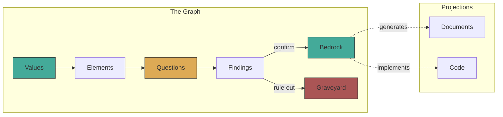

# KOS — Knowledge Operating System

Every project loses the understanding that built it. The code ships, but the
reasoning — failed approaches, load-bearing assumptions, why *this* design and
not *that* one — evaporates. Documents written before building capture intent,
not discovery. Documents written after are archaeology.

KOS treats **accumulated understanding as the primary product**. Not code, not
documents — the knowledge graph underneath both.

## The idea

Documents and code are *lossy projections* of a richer structure — like 2D
shadows of an N-dimensional object. The graph can always generate the documents.
The documents cannot recover the graph.



Signal — contradictions, gaps, drift — appears at the seams between
projections, where documents disagree with each other or with code.

## What exists today

A Rust CLI and a process cycle, both used to investigate the thesis.

**The CLI** reads typed YAML nodes from git, validates them, renders
graphs, detects drift, and surfaces relevant knowledge per-repo:

```
kos orient <repo>     # what does the graph know about this repo?
kos validate          # schema check all nodes
kos graph             # render node graph (mermaid or dot)
kos drift             # content hash + edge walk → flag stale dependents
kos bridge            # extract findings from prose briefs
kos init              # onboard a new repo into the graph
kos doctor            # health check structure, content, process
```

**The process** is a single cycle: Orient → Ideate → Question → Probe →
Harvest → Promote (or Graveyard). Nothing is deleted. Confidence has three
states: bedrock (established), frontier (hypothesis), graveyard (ruled out
with rationale).

**The graph** spans 6 repos (181 nodes, 36 findings, 0 validation failures).

## What we've learned

Tested against 16 real projects. Found signal at document seams in every one.
About 45% of issues found are consequential — bugs, confusion, wasted effort.
The graph doesn't find *more* problems than humans — it finds them *faster*.

The strongest predictor of signal yield is the **review gap**: whether anyone
checks if documents agree with *each other*.

The most important findings are about how knowledge works:

1. Documents, code, and repos are all lossy projections of richer understanding.
   The same flattening recurs at every layer.
2. The graph holds only what's been declared. The human's role is seeing
   undeclared structure and promoting it from tacit to explicit.
3. Soft constraints (prose, agent definitions, advisory registries) fail under
   concurrent execution. Infrastructure enforcement (hooks, CI, tooling) works.

## The ThreeDoors bootstrap

The first real-scale test. 104 nodes decomposed from ~800 existing documents
across 6 layers (ADRs, decision board, incident reports, architecture specs,
PRD, dark factory governance). Results:

- Found that one ADR was contradicted by 3 of 4 documented incidents — invisible
  reading any single document
- Found 16 "open" questions already resolved, duplicate IDs in the decision
  board, and a philosophy document contradicted by actual product scope
- Filed [8 actionable issues](https://github.com/ArcavenAE/ThreeDoors/issues?q=is%3Aissue+kos+in%3Atitle) against the project

Central finding: all four incidents shared a root cause — rules encoded as
instructions (prose) instead of infrastructure (hooks, CI). The project's own
governance model states this principle but hadn't fully applied it.

## Where this is going

The CLI proved the graph model works. But KOS is research into whether a
different substrate — not files, not documents — could serve as the foundation
for human-AI collaborative cognition.

The YAML-in-git layer is a scaffold. It demonstrated the thesis (files produce
drift invisible to file-by-file reading) while being files itself. The charter
identifies five properties the substrate needs that files structurally cannot
provide: first-class relationships, preserved reasoning chains, on-demand
projections, context that survives session breaks, and concurrent transaction
semantics.

That's the frontier. See [KOS-charter.md](KOS-charter.md) for the full state.

## Quick start

Requires Rust 1.85+.

```sh
cargo build                    # build the CLI
kos orient <repo>              # orient on a repo
kos validate --merged          # validate all discovered graphs
kos graph --format mermaid     # render the graph
kos drift                      # detect content changes and stale dependents
```

## Status

Research project with working tools. 11 sessions, 36 findings, 181 nodes
across 6 graphs. The CLI is scaffolding that proved the model. The model is
under active investigation. The substrate is future work.
